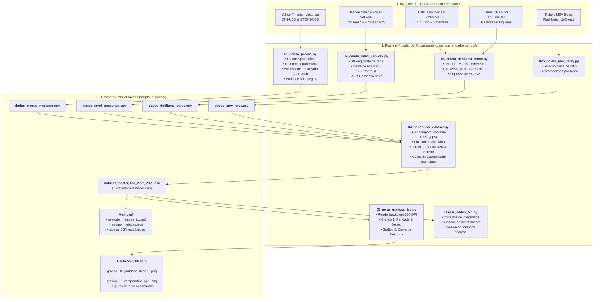

# TCC — Engenharia de Dados e Análise Empírica: Lido DAO & Liquid Staking no Ethereum


Repositório oficial contendo o código-fonte, a pipeline automatizada de coleta on-chain, os datasets consolidados em formato CSV, o relatório econométrico e as figuras acadêmicas em 300 DPI desenvolvidas para o Trabalho de Conclusão de Curso (TCC) em Finanças Descentralizadas (DeFi).

> **Tema:** Finanças Descentralizadas: A avaliação do liquid staking via Lido DAO como alternativa de investimento em ativos digitais  
> **Recorte Temporal:** 05/05/2022 a 31/05/2026 (Frequência Diária UTC contínua — 1.488 observações)  
> **Dicionário Completo de Variáveis:** Consulte o arquivo [`DICIONARIO_DE_DADOS.md`](DICIONARIO_DE_DADOS.md)

---

## 🧭 Organograma da Pipeline de Dados

A arquitetura de engenharia de dados do projeto é estruturada de forma modular, sequencial e auditável. O fluxo de dados opera desde a ingestão via APIs públicas até a renderização dos gráficos finais de 300 DPI e relatórios estatísticos:



---

## 🔬 Metodologia e Processo de Coleta de Dados

A extração de dados foi projetada para garantir **reprodutibilidade científica, integridade estatística e resiliência contra falhas de API**:

1. **Janela Temporal Padronizada:**
   * **Início:** 05/05/2022 (marca do início da desancoragem do stETH durante o colapso de Terra/LUNA).
   * **Término:** 31/05/2026 (série temporal completa de 1.488 dias contínuos).
   * **Grid Temporal:** Frequência diária baseada no horário UTC (`00:00:00 UTC`), eliminando descasamentos de fuso horário.

2. **Fontes de Dados Primárias e APIs Utilizadas:**
   * **DefiLlama Protocols & Yields API:** Extração do histórico diário de TVL sob custódia da Lido DAO, TVL total do ecossistema Ethereum, rendimentos APY do staking e métricas de liquidez da pool Curve.
   * **Yahoo Finance API (`yfinance`):** Cotações diárias de fechamento (*Close spot prices*) para `ETH-USD` e `STETH-USD`, com validação cruzada pela API de Coins da DefiLlama.
   * **Protocolo Ethereum (Beacon Chain & Rated Network):** Modelagem e extração da taxa de emissão de consenso pelo volume de validadores ativos e depósitos na Beacon Chain ($APR = \frac{16632}{\sqrt{S}}$).
   * **MEV-Boost Relays (Flashbots / bloXroute):** Amostragem de recompensas de blocos na camada de execução.

3. **Mecanismos de Resiliência e Tratamento de Dados:**
   * **Zero Gaps & Grid Contínuo:** Utilização de `pd.date_range` com reindexação diária para assegurar que nenhum dia fique sem registro.
   * **Conversão Financeira de APY para APR:** Padronização estrita de taxas compostas (APY) para taxas nominais anuais (APR com capitalização diária $n=365$):
     $$\text{APR} = 365 \times \left((1 + \text{APY})^{1/365} - 1\right)$$
   * **Controle de Rate-Limits:** Implementação de espaçamento entre chamadas HTTP com *backoff* exponencial e *timeouts* de 60 segundos.
   * **Auditoria Automatizada:** Execução do módulo `validar_dados_tcc.py` com 20 testes de estresse (verificação de não-negatividade, teste de variabilidade temporal, verificação de limites do depeg e flags binárias).

---

## 📑 Resumo das Tabelas e Datasets Gerados

Para a descrição completa de cada uma das colunas, unidades e equações, consulte o documento [`DICIONARIO_DE_DADOS.md`](DICIONARIO_DE_DADOS.md).

| Tabela CSV | Localização | Descrição | Principais Indicadores |
|---|---|---|---|
| **`dataset_master_tcc_2022_2026.csv`** | `scripts_e_dados/Dados/` | Master Dataset com todas as séries temporais consolidadas | `Date`, `preco_steth_eth`, `depeg_pct`, `delta_apr_pct`, `taxa_retencao_efetiva_pct`, `tvl_lido_total_usd` |
| **`dados_precos_mercado.csv`** | `scripts_e_dados/Dados/` | Preços de fechamento, retornos e volatilidades móveis | `preco_eth_usd`, `preco_steth_usd`, `volatilidade_7d_anual_eth`, `volatilidade_30d_anual_steth` |
| **`dados_rated_consenso.csv`** | `scripts_e_dados/Dados/` | Rendimento da camada de consenso do Ethereum | `apr_consenso_bruto_pct`, `apr_rede_direto_total_pct`, `total_staked_eth_network` |
| **`dados_defillama_curve.csv`** | `scripts_e_dados/Dados/` | Liquidez DeFi, dominância e pool DEX Curve | `tvl_lido_ethereum_usd`, `dominancia_lido_tvl_defi_pct`, `tvl_pool_curve_usd`, `apr_base_nominal_pct` |
| **`dados_mev_relay.csv`** | `scripts_e_dados/Dados/` | Extração de MEV e taxas de prioridade | `mev_valor_medio_bloco_eth`, `mev_total_diario_estimado_eth` |

---

## 📂 Estrutura Modular do Repositório

```text
TCC_DEFI/
├── README.md                     # Documentação oficial, organograma e metodologia
├── DICIONARIO_DE_DADOS.md        # Dicionário detalhado de todas as variáveis e equações
├── notebook_tcc_lido_defi.ipynb # Notebook interativo para o Google Colab / Jupyter
├── requirements.txt             # Dependências Python para instalação via pip / venv
├── .env.example                 # Modelo de configuração de chaves de API (opcional)
│
├── artigos_cientificos/         # Biblioteca de artigos acadêmicos da literatura (PDFs)
│   ├── selecionados/            # Os 10 artigos primários citados no texto do TCC
│   ├── referencia/              # Artigos mantidos para fundamentação teórica
│   ├── baixados/                # Acervo bibliográfico de apoio
│   └── descartados/             # Artigos filtrados não utilizados
│
├── scripts_e_dados/             # PIPELINE OFICIAL E ATIVA (2022 - 2026)
│   ├── scripts/                 # Módulos Python da pipeline quantitativa
│   │   ├── 01_coleta_precos.py          # Módulo 1: Preços, retornos e volatilidade
│   │   ├── 02_coleta_rated_network.py   # Módulo 2: Camada de consenso e staking direto
│   │   ├── 02b_coleta_mev_relay.py      # Módulo 2b: Extração de MEV na execução
│   │   ├── 03_coleta_defillama_curve.py # Módulo 3: TVL Lido e Pool DEX Curve
│   │   ├── 04_consolidar_dataset.py     # Módulo 4: Consolidação do Master Dataset
│   │   ├── 05_gerar_graficos_tcc.py     # Módulo 5: Renderização de gráficos em 300 DPI
│   │   ├── executar_pipeline.py         # Orquestrador mestre da pipeline completa
│   │   ├── formatar_dataset.py          # Padronizador de esquema e datas
│   │   ├── validar_dados_tcc.py         # Validador e auditor de integridade estatística
│   │   └── utils.py                     # Utilitários e helpers de API
│   │
│   ├── Dados/                    # Datasets em formato CSV do Master Dataset ativo
│   ├── Metricas/                 # Relatórios estatísticos, testes t/F e JSON
│   └── Graficos/                 # Figuras em alta resolução (300 DPI) para o texto
│
└── obsoletos/                   # Pasta isolada de arquivos, tabelas e scripts legados
```

---

## 🚀 Como Executar o Projeto

### Opção A: Execução no Ambiente Virtual Local (`venv` + `pip`)

1. **Abra o terminal ou PowerShell** na pasta raiz do projeto e crie o ambiente virtual:
   ```powershell
   python -m venv .venv
   ```

2. **Ative o ambiente virtual:**
   * No Windows (PowerShell):
     ```powershell
     .\.venv\Scripts\Activate.ps1
     ```
   * No Linux / macOS:
     ```bash
     source .venv/bin/activate
     ```

3. **Instale os pacotes necessários:**
   ```bash
   pip install -r requirements.txt
   ```

4. **Execute a pipeline mestre completa:**
   ```bash
   python scripts_e_dados/scripts/executar_pipeline.py
   ```

---


